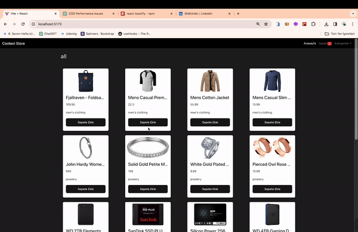

<h1> React_E-Commerce </h1>

This project encompasses a React application that provides an e-commerce experience developed using the FakeStore API. The project includes data fetching with Axios, management of product and cart states using the React Context API, a modern design with Bootstrap integration, and user interaction through React Toastify.

<h2> The technologies and libraries used in the project </h2>
<ul>
<li>ReactJS: Chosen for its user-friendly interface and component-based structure</li>
<li>Axios: Used for fetching data from the FakeStore API.</li>
<li>Bootstrap: Provides a modern and responsive design with CSS and JS integration.</li>
<li>React Toastify: Offers notifications to inform users and enhance interaction</li>
</ul>

<h2> Demo </h2>

You can view a live demo of this project [here](https://seliinatmaca.github.io/React_E-Commerce/).

<h2> Screenshot </h2>

# React_E-Commerce
